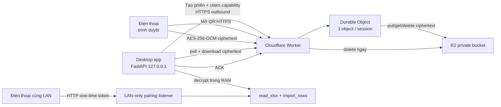

# Hybrid Pairing — Cloudflare Pairing Relay

## Trạng thái quyết định

- **Đã chốt:** Hybrid Pairing gồm hai đường độc lập: `LAN` (nhanh, riêng tư, không cần Internet) và `Cloud relay` (điện thoại/máy tính có thể ở khác mạng).
- **Giữ nguyên:** Python core, FastAPI loopback guard, SQLite/Postgres, import pipeline, deduplication và KPI.
- **Phiên bản:** tài liệu ban đầu được gọi là kế hoạch v2.0.7, nhưng source hiện tại đã ở v2.0.29. Không hạ version; thay đổi này sẽ được phát hành ở version kế tiếp sau khi smoke production đạt.
- **Hostname production:** `aff-report.huuhungn.io.vn` (zone `huuhungn.io.vn` đã được quản lý trên Cloudflare).
- **Fallback đã deploy:** `https://affiliate-report-pairing-relay.huuhungn.workers.dev` của cùng Worker để tự chuyển đổi khi custom domain gặp sự cố.
- **Cloudflare plan:** thiết kế chạy được trên Workers Free + Durable Objects SQLite + R2 Standard free tier.

## Mục tiêu

1. Người dùng cài app desktop rồi dùng ngay, không cần Cloudflare account, token, domain hoặc cấu hình riêng.
2. Cùng Wi-Fi/LAN vẫn là lựa chọn ưu tiên và không phụ thuộc cloud.
3. Khác mạng dùng HTTPS outbound từ desktop tới Cloudflare; không cần mở port, Cloudflare Tunnel hay một máy cloud chạy thường trực.
4. Cloudflare không nhìn thấy nội dung Excel: trình duyệt điện thoại mã hóa AES-256-GCM trước khi upload.
5. File cloud chỉ tồn tại tạm thời, dùng một lần, xóa ngay sau import thành công hoặc tự xóa bằng Durable Object alarm.
6. Cả hai đường cùng gọi đúng `read_xlsx` + `import_rows` hiện có để giữ nguyên kiểm tra định dạng, chống trùng và versioning.

## Ngoài phạm vi

- Cloudflare không trở thành database báo cáo hoặc nơi đồng bộ lịch sử đơn hàng.
- Không public FastAPI/SQLite local ra Internet.
- Không nhúng API token, R2 credential hoặc Cloudflare secret vào installer.
- Không hỗ trợ file ngoài `.xlsx`, file lớn hơn 20 MiB hoặc giữ file lâu dài.
- Không hứa full offline cho đường cloud; khi cloud lỗi, LAN và upload trên PC vẫn hoạt động.

## Kiến trúc



### Thành phần

| Thành phần | Trách nhiệm | Dữ liệu được phép thấy |
|---|---|---|
| Desktop `CloudPairingRunner` | Sinh capability/key, tạo phiên, poll, tải, giải mã, import, ACK | key AES, token upload/claim, plaintext Excel |
| Worker | Validate HTTP/protocol/size, route session, phục vụ upload page | session id, token hash/capability khi request, ciphertext |
| Durable Object `PairingSession` | State machine nhất quán, one-time transitions, alarm cleanup | token hashes, trạng thái, R2 object key, kích thước |
| R2 private bucket | Giữ ciphertext ngắn hạn | ciphertext và metadata kỹ thuật tối thiểu |
| Trình duyệt điện thoại | Đọc key/token từ URL fragment, mã hóa file, upload | plaintext Excel, AES key, upload capability |

## Protocol v1

### Capability và QR

Desktop sinh bằng CSPRNG:

- `session_id`: định danh public ngẫu nhiên.
- `upload_token`: chỉ điện thoại dùng để upload.
- `claim_token`: chỉ desktop dùng để poll/download/ACK.
- `aes_key`: 32 byte cho AES-256-GCM.

Worker chỉ nhận SHA-256 của `upload_token` và `claim_token`. QR có dạng:

```text
https://aff-report.huuhungn.io.vn/pair/<session_id>#k=<base64url-key>&u=<base64url-upload-token>
```

Phần sau `#` không được gửi trong HTTP request, nên Worker/R2 không nhận AES key hoặc upload token từ lần mở trang. JavaScript trên trang đọc fragment, xóa fragment khỏi address bar bằng `history.replaceState`, mã hóa file rồi gửi upload token qua header capability.

### Envelope mã hóa

Plaintext trước khi mã hóa:

```text
4-byte big-endian metadata length
UTF-8 JSON metadata { schema, filename, size, mime }
raw XLSX bytes
```

Body upload:

```text
12-byte random AES-GCM IV
AES-GCM ciphertext + 16-byte authentication tag
```

Associated data là chuỗi `affiliate-report-pairing-v1:<session_id>` để ciphertext không thể chuyển sang phiên khác.

### API relay

| Method | Route | Capability | Ý nghĩa |
|---|---|---|---|
| `GET` | `/health` | Không | Health/version công khai, không trả binding/secret |
| `POST` | `/api/v1/sessions` | Rate-limited | Tạo session từ token hashes; TTL 5 phút |
| `GET` | `/pair/:session_id` | Không | Trang upload tĩnh, accessible/mobile-first |
| `PUT` | `/api/v1/sessions/:id/file` | Upload token | Stream ciphertext vào R2, tối đa 20 MiB + envelope |
| `GET` | `/api/v1/sessions/:id` | Claim token | Poll state |
| `GET` | `/api/v1/sessions/:id/file` | Claim token | Stream ciphertext về desktop |
| `POST` | `/api/v1/sessions/:id/ack` | Claim token | Xóa R2 rồi đóng session |
| `DELETE` | `/api/v1/sessions/:id` | Claim token | Hủy phiên và xóa R2 |

### State machine

```text
created -> uploading -> ready -> deleted
    |          |          |
    +----------+----------+-> expired (logical response; storage/object cleaned)
```

- QR/upload TTL: 5 phút.
- Hard retention: tối đa 15 phút từ lúc tạo.
- `uploading` được persist trước khi ghi R2 để chặn upload đồng thời.
- `ready` chỉ được persist sau khi R2 put thành công và đúng size.
- ACK xóa R2 thành công trước khi đánh dấu `deleted`.
- Alarm xóa object và toàn bộ state nếu app biến mất hoặc không ACK.

## Bảo mật và abuse controls

- TLS do Cloudflare cấp cho custom domain.
- AES-256-GCM end-to-end cho nội dung file; key không rời điện thoại/desktop.
- Capability 256 bit, SHA-256 at rest, so sánh constant-time.
- Session id khó đoán nhưng không được xem là secret.
- Từ chối filename không phải `.xlsx`, content type sai, body thiếu/không hợp lệ, size vượt giới hạn, token sai, phiên hết hạn hoặc đã dùng.
- Rate Limiting binding giới hạn tạo phiên theo client network để giảm spam; đây là abuse control permissive, không phải accounting/security boundary.
- R2 bucket không public, không dùng `r2.dev`, không custom-domain trực tiếp vào bucket.
- Log có cấu trúc nhưng không ghi token, fragment, key, body, filename gốc hoặc absolute path desktop.
- Worker không nhận Cloudflare REST token lúc runtime; chỉ dùng DO/R2 bindings.

### Threats còn lại

- Máy desktop hoặc điện thoại đã bị chiếm quyền vẫn có thể đọc plaintext/key trong chính tiến trình đó.
- Người có QR đầy đủ trước khi fragment bị xóa có thể upload thay người dùng trong TTL.
- Free plan có quota; khi vượt quota đường cloud fail closed, nhưng LAN/local import vẫn dùng được.
- Rate limiter theo network có thể gom nhiều người sau NAT; ngưỡng được đặt đủ cao cho thao tác thật.

## UX Hybrid

- Panel hiển thị hai lựa chọn rõ ràng:
  - **Cùng Wi-Fi — nhanh nhất:** dùng listener LAN hiện có.
  - **Khác mạng — qua Cloudflare:** dùng relay HTTPS.
- Không tự public dữ liệu hoặc tự bật cloud. Người dùng chủ động tạo QR cho account đang chọn.
- Status chung: đang tạo mã, chờ điện thoại, đang nhận, đang giải mã, đang import, hoàn tất, hết hạn, lỗi cloud.
- Đường cloud lỗi có CTA dùng LAN hoặc chọn file trực tiếp; không làm mất hàng đợi/import history.
- UI không hiển thị token/key/technical exception.

## Free plan và sức chứa dự kiến

- Workers Free hiện giới hạn 100.000 requests/ngày và request body của Cloudflare Free tối đa 100 MB; app chủ động giữ 20 MiB.
- Durable Objects SQLite dùng được trên Workers Free. Mỗi session là một DO nhỏ, alarm cleanup không để state tăng vô hạn.
- R2 Standard có free tier 10 GB-month, 1 triệu Class A và 10 triệu Class B mỗi tháng; ciphertext chỉ sống tối đa 15 phút nên phù hợp nhóm người dùng nhỏ.
- Nếu vượt bất kỳ quota free nào, relay trả lỗi; app phải fallback LAN/local, không tự phát sinh gói trả phí.

## Acceptance criteria

### Chức năng

1. LAN pairing cũ giữ nguyên test và chạy khi không có Internet/Cloudflare.
2. Điện thoại dùng 4G/5G hoặc Wi-Fi khác gửi được file tới desktop chỉ bằng QR.
3. Desktop fresh install không cần Cloudflare login/token/domain config.
4. File cloud đi vào đúng `read_xlsx` + `import_rows`; dedup và import history giống upload desktop/LAN.
5. Chỉ owner/operator trong account scope tạo hoặc hủy QR; viewer bị 403; mutation vẫn yêu cầu CSRF.
6. Tạo lại QR làm phiên app cũ bị hủy best-effort và không lẫn kết quả.

### Security/privacy

7. Không có Cloudflare credential/secret trong source, installer, API response, QR, log hoặc artifact.
8. Test chứng minh R2/Worker chỉ nhận ciphertext; không tìm thấy XLSX magic bytes hoặc filename plaintext trong object.
9. AES key chỉ nằm trong URL fragment và RAM; HTTP access log/request không chứa key.
10. Token sai, token reuse, session mismatch, expired session, oversize và non-XLSX đều fail closed.
11. State transitions one-time và nhất quán dưới request đồng thời.
12. ACK xóa R2 ngay; alarm dọn session bỏ dở không muộn hơn hard TTL.

### Độ bền và UX

13. Cloud timeout/outage không chặn dashboard, local import hoặc LAN pairing.
14. Desktop restart trong phiên cloud làm phiên cũ tự hết hạn; không giữ key xuống disk.
15. UI mobile upload có label/focus/status/progress, touch target tối thiểu 44 px và không overflow ở 320 px.
16. UI desktop nói rõ khi nào dùng LAN/Cloud và có hướng fallback đọc được.

### Verification/release

17. Worker typecheck, Vitest/Miniflare, Wrangler dry-run và secret scan đều xanh.
18. Python unit/API tests phủ decrypt/tamper/TTL/cancel/RBAC/CSRF/relay outage.
19. Frontend lint/typecheck/build + Playwright phủ hai mode và trạng thái lỗi.
20. Production smoke dùng custom hostname, điện thoại/runner khác mạng, import marker thành công, object R2 đã xóa và Workers logs không lộ capability.
21. Release chỉ bump version sau khi installer smoke giữ dữ liệu và production relay smoke xanh.

## Rollout

1. Dựng Worker/DO/R2 và test local.
2. Deploy `workers.dev` fallback, chạy protocol smoke không dùng dữ liệu thật.
3. Gắn custom domain `aff-report.huuhungn.io.vn`; Cloudflare tự quản DNS record và TLS khi zone active.
4. Tích hợp desktop phía sau capability `cloud_pairing` nhưng giữ LAN mặc định.
5. Chạy E2E cross-network và cleanup evidence.
6. Bump version kế tiếp, build installer, upgrade smoke, rồi mới phát hành.
