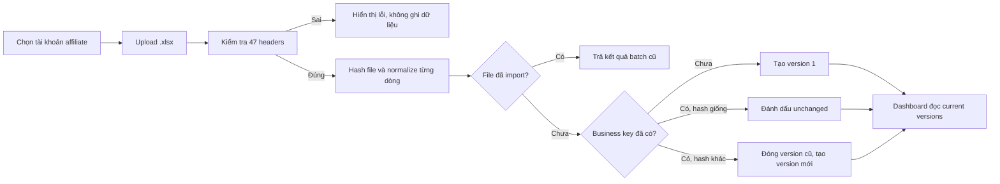
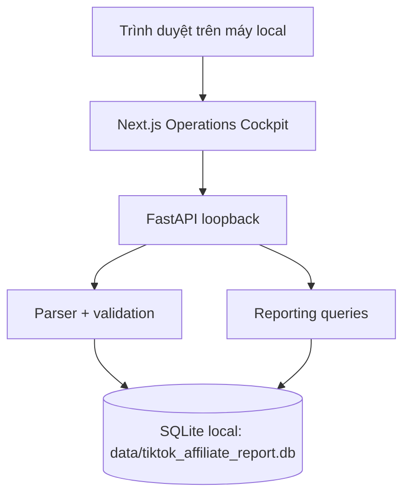

# PRD — TikTok Affiliate Report MVP

## 1. Tóm tắt

TikTok Affiliate Report là web app nội bộ chạy local trên Windows, giúp người vận hành upload các file Excel xuất từ TikTok, tự động loại trùng giữa các lần export bị chồng dữ liệu, và xem báo cáo ngày/tháng theo cùng logic đang dùng trong `REPORT AFF.xlsx`.

MVP production dùng Next.js Operations Cockpit do FastAPI phục vụ trên loopback và một cơ sở dữ liệu SQLite tại máy local. Không cần queue, microservice, data warehouse, Docker hay dịch vụ database riêng.

## 2. Contacts

| Vai trò | Người phụ trách | Trách nhiệm |
|---|---|---|
| Product owner | Chủ hệ thống | Chốt định nghĩa KPI, tài khoản affiliate và cách dùng dữ liệu |
| Operator | Người upload | Chọn đúng tài khoản affiliate, upload file, xử lý cảnh báo |
| Viewer | Người xem báo cáo | Xem dashboard và tra cứu đơn hàng trên máy local |
| Technical owner | Chưa chỉ định | Vận hành máy chạy app, backup file SQLite và cập nhật parser |

## 3. Bối cảnh

### 3.1 Vấn đề hiện tại

- TikTok có thể export lại các đơn đã xuất trước đó khi người dùng filter hoặc dùng filter mặc định.
- Một đơn có thể có nhiều SKU, nên `ID đơn hàng` không đủ để xác định một dòng dữ liệu.
- Trạng thái và số tiền của cùng một dòng có thể thay đổi ở lần export sau.
- Workbook báo cáo hiện tại nhập số liệu theo ngày và theo ba tài khoản affiliate, có nhiều điều chỉnh thủ công nên khó audit.
- File TikTok không chứa tên tài khoản affiliate sở hữu file. `Tên cửa hàng` là shop bán hàng, không phải tài khoản affiliate. Vì vậy người upload phải chọn tài khoản trước khi import.

### 3.2 Dữ liệu đã phân tích

- Bốn file TikTok mẫu có cùng 47 cột, tổng 5.510 dòng; grain là một dòng đơn hàng/SKU.
- Không có cặp `ID đơn hàng + ID SKU` trùng trong hoặc giữa bốn file; versioning vẫn cần vì các lần export sau có thể overlap/đổi trạng thái.
- Có 61 đơn nhiều SKU, nên không được dedupe chỉ bằng `ID đơn hàng`.
- Có ngày quyết toán là `/`; giá trị này phải thành `NULL`, không phải lỗi.
- Workbook báo cáo có sáu sheet từ tháng 03/2026 đến 08/2026, ba block tài khoản `CHIISTORE`, `EMLINHNOIY`, `THAOBRA`, và một block tổng.
- Đối soát mẫu cho thấy file `7669183192696293140_1` khớp `CHIISTORE`, file `7668993110945826580_1` khớp `EMLINHNOIY`, và file `7669183192695768852_1` khớp `THAOBRA` với độ tin cậy cao. Đây chỉ là evidence nghiên cứu; runtime không suy account từ filename.
- File `7669031960321165076_1` chỉ có hai dòng nên chưa đủ bằng chứng gán account.

## 4. Mục tiêu

### 4.1 Mục tiêu sản phẩm

1. Upload file TikTok mà không nhân đôi dữ liệu khi file bị overlap.
2. Giữ lịch sử thay đổi của từng dòng đơn hàng/SKU để audit.
3. Tạo báo cáo ngày/tháng khớp logic workbook hiện tại.
4. Cho người không chuyên kỹ thuật chạy app local trên Windows bằng launcher `START_REPORT.bat`.

### 4.2 Key Results cho MVP

| KR | Mục tiêu nghiệm thu |
|---|---|
| KR1 | Upload lại cùng file không tạo thêm batch hoặc version dữ liệu mới |
| KR2 | Upload file overlap chỉ tạo version mới cho dòng có nội dung thay đổi |
| KR3 | Dashboard chỉ đọc version hiện hành, không double-count |
| KR4 | Công thức báo cáo ngày khớp mapping đã chốt tới đơn vị VND trên dữ liệu đã normalize |
| KR5 | File khoảng 1.000 dòng được import trong dưới 30 giây trên máy Windows thông thường |
| KR6 | Header sai, dòng lỗi và trạng thái lạ đều có thông báo; không bỏ dữ liệu âm thầm |

## 5. Phân khúc người dùng

### 5.1 Operator không chuyên kỹ thuật

**Job:** “Tôi muốn upload file vừa tải từ TikTok và có báo cáo đúng mà không phải biết SQL hay code.”

Ràng buộc:

- Không biết cấu trúc database.
- Có thể chọn nhầm tài khoản affiliate.
- Có thể upload lại cùng file hoặc file chứa đơn cũ.

### 5.2 Owner/analyst

**Job:** “Tôi muốn biết doanh thu, hoa hồng, huỷ và mức đạt KPI theo ngày/tháng, đồng thời tra được đơn tạo ra con số đó.”

### 5.3 Technical owner

**Job:** “Tôi muốn một hệ thống nhỏ, dễ backup, dễ chạy lại và không có nhiều service phải bảo trì.”

## 6. Giá trị mang lại

- Không phải xoá trùng thủ công trong Excel/Google Sheets.
- Không làm mất lịch sử khi trạng thái đơn đổi.
- Báo cáo có thể drill-down về dòng nguồn và batch upload.
- Công thức KPI có tên rõ ràng, tránh nhầm “hoa hồng thực nhận của TikTok” với “hoa hồng thực tế theo logic workbook”.
- Một codebase chạy local bằng FastAPI + static Next.js và SQLite; shared multi-user dùng cùng API với PostgreSQL/OIDC.

## 7. Giải pháp

### 7.1 User flow



### 7.2 Màn hình MVP

1. **Upload**
   - Chọn tài khoản affiliate bắt buộc; selector không có giá trị mặc định.
   - Không tự suy account từ filename hoặc `Tên cửa hàng`.
   - Upload `.xlsx`.
   - Preview và kết quả `inserted / updated / unchanged / rejected`.
   - Báo rõ file đã import trước đó.

2. **Tổng quan**
   - Đơn hàng duy nhất.
   - Dòng đơn hàng.
   - Số món bán/hoàn.
   - GMV.
   - Hoa hồng ban đầu.
   - Doanh thu và hoa hồng thực tế theo logic workbook.
   - Tổng nhận cuối cùng từ TikTok.

3. **Báo cáo ngày**
   - Filter tháng và tài khoản.
   - Các cột: số lượng, tổng doanh thu, tổng hoa hồng ban đầu, doanh thu huỷ, hoa hồng huỷ, doanh thu thực tế, hoa hồng thực tế, KPI ngày, tỷ lệ đạt.

4. **Google Sheets output**
   - Một dòng mỗi ngày, ba block account và các cột tổng/KPI theo `REPORT AFF.xlsx`.
   - Tải CSV UTF-8 để import vào Google Sheets; không cần cấp Google credential cho app.

5. **Đơn hàng**
   - Search theo order, SKU, sản phẩm hoặc shop.
   - Mặc định chỉ hiện version hiện hành.

6. **Lịch sử import**
   - Tên file, tài khoản, thời gian và số lượng inserted/updated/unchanged/rejected.

### 7.3 Công thức nghiệp vụ

Tất cả KPI báo cáo ngày dùng `Ngày đặt hàng` và version hiện hành.

```text
units_sold = SUM(Số món bán ra)
gross_revenue = SUM(GMV)
initial_commission = SUM(
  Hoa hồng tiêu chuẩn ước tính
  + Hoa hồng Quảng cáo cửa hàng ước tính
  + Thưởng ước tính
  + Thưởng ước tính của đối tác liên kết
  + Ước tính phần chia doanh thu
)
cancelled_revenue = SUM(GMV WHERE canonical_status = 'ineligible')
cancelled_commission = SUM(initial_commission WHERE canonical_status = 'ineligible')
actual_revenue = gross_revenue - cancelled_revenue
actual_commission = initial_commission - cancelled_commission
```

`Tổng số tiền nhận được cuối cùng` là KPI TikTok riêng. Không dùng nó thay cho `actual_commission` của workbook.

### 7.4 Dedupe và versioning

- File-level dedupe: SHA-256 của file.
- Business key: `affiliate_account + ID đơn hàng + ID SKU`.
- Row hash: SHA-256 của dữ liệu 47 cột sau khi normalize ổn định.
- Cùng business key + cùng row hash: `unchanged`.
- Cùng business key + row hash khác: version hiện tại thành `is_current = false`, tạo version mới.
- Một dòng biến mất khỏi file mới không có nghĩa là bị xoá.
- ID phải lưu dạng `TEXT`; không đổi sang số vì có thể mất chữ số.
- Dòng không đọc được (thiếu ID đơn/SKU, ngày sai định dạng) chỉ bị loại riêng dòng đó, kèm số dòng thật trong file Excel và lý do; phần còn lại của file vẫn được nhập.
- File chỉ cần có đủ 47 cột TikTok; thứ tự cột không quan trọng và cột lạ được bỏ qua kèm cảnh báo, không chặn cả file.
- Một lần nhập hoàn tác được: gỡ các version thuộc batch đó rồi trả `is_current` về version còn lại mới nhất, trừ khi một lần nhập mới hơn đã đè lên cùng business key.

### 7.5 Kiến trúc



Lựa chọn này cố ý nhỏ:

- Không background worker vì file mẫu dưới 1.000 dòng.
- Không object storage trong MVP; lưu raw row JSON đủ để audit/replay.
- Không tách bảng product/shop/content trước khi có nhu cầu query thật.
- Máy chạy app và file database SQLite là boundary vận hành của MVP local.
- Launcher Windows `START_REPORT.bat` build web khi cần, khởi động FastAPI trên một cổng loopback còn trống, tự mở trình duyệt và giữ database trong `data/`.

### 7.6 Database

Schema chi tiết nằm ở `docs/schema.sql`. Bốn bảng nghiệp vụ và một bảng migration:

- `import_batches`: audit và dedupe theo file.
- `raw_import_rows`: snapshot từng dòng nguồn.
- `order_line_versions`: fact table có version.
- `monthly_targets`: KPI theo tài khoản/tháng.
- `schema_migrations`: version/checksum của DDL đã áp dụng.

Migration chạy khi app khởi động. Bản đầu chỉ additive/adopt schema hiện hữu, không rebuild hoặc xoá bảng SQLite cũ.

### 7.7 Xử lý lỗi

| Tình huống | Hành vi |
|---|---|
| File không phải `.xlsx` hoặc workbook hỏng | Dừng batch và hiện lỗi |
| File vượt 20 MB hoặc 50.000 dòng | Dừng trước import và hiện giới hạn |
| Thiếu/thừa header bắt buộc | Dừng batch, liệt kê khác biệt |
| `Ngày quyết toán hoa hồng = /` | Lưu `NULL` |
| Status chưa biết | Lưu raw status, canonical `unknown`, hiện cảnh báo |
| ID rỗng | Reject dòng |
| Hai dòng cùng business key nhưng khác nội dung trong một file | Reject/collision, không tự merge |
| File trùng hash | Không import lại |

### 7.8 Vận hành local

- Database mặc định nằm tại `data/tiktok_affiliate_report.db`; không commit file database thật.
- Backup bằng cách copy file SQLite khi app đã tắt.
- Không log toàn bộ row chứa dữ liệu nhạy cảm.

### 7.9 Quy ước đã chốt từ dữ liệu hiện có

1. Ba account ban đầu là `CHIISTORE`, `EMLINHNOIY`, `THAOBRA`.
2. KPI workbook là KPI hoa hồng thực tế tổng/ngày.
3. Báo cáo chính dùng ngày đặt hàng, không dùng ngày quyết toán.
4. Status `Không đủ điều kiện` là nguồn xác định phần huỷ.
5. `REPORT AFF.xlsx` tải từ Google Sheets gốc là nguồn thiết kế output legacy duy nhất và đã đủ cho MVP; link gốc không phải dependency của app.

## 8. Release

### MVP — đã định nghĩa trong tài liệu này

- Parser file 47 cột.
- Dedupe file và versioning order-line.
- Dashboard, báo cáo ngày, explorer, import history.
- CSV wide Google Sheets-ready.
- SQLite local.
- Versioned migrations.
- Launcher Windows one-click tên `START_REPORT.bat`.

### Pilot local

- Chạy với dữ liệu thật của ba account trên máy Windows được chọn.
- Đối soát 1–2 tháng với workbook/Google Sheets.
- Chốt rounding, timezone và status mới.
- Kiểm tra quy trình backup/restore file SQLite trước khi dùng thường xuyên.

### Sau pilot, chỉ thêm khi có nhu cầu thật

- Sync trực tiếp Google Sheets API nếu CSV không còn đủ.
- Upload nhiều file trong một lần.
- Lịch import tự động từ API nếu TikTok cung cấp quyền phù hợp.
- Retention file gốc khi audit yêu cầu.

## 9. Quyết định nền tảng dài hạn

Operations Cockpit Next.js là UI production cho local web/desktop và là surface dùng chung cho PWA/mobile wrapper. Streamlit đã được loại khỏi runtime để tránh duy trì hai giao diện và mở rộng custom UI thuận tiện hơn.

Lộ trình ít viết lại nhất:

1. Giữ `parser`, dedupe, migration và reporting core trong Python, độc lập với giao diện.
2. Dùng cùng FastAPI + Next.js/PWA cho local single-user và shared web; shared mode bật OIDC, account access và PostgreSQL.
3. Khi cần phân phối desktop native ngoài bộ cài hiện tại, bọc web UI bằng Tauri; khi cần app store, bọc cùng PWA bằng Capacitor cho Android/iOS.
4. Chỉ chọn Expo/React Native thay Capacitor khi offline/background, push notification hoặc native gesture trở thành yêu cầu chính.

Ngưỡng thêm native wrapper: có yêu cầu app-store distribution, background task, push/deep link hoặc tích hợp thiết bị mà PWA không đáp ứng. Trước ngưỡng đó, một codebase responsive/PWA là phương án ít vận hành và ít viết lại nhất.
